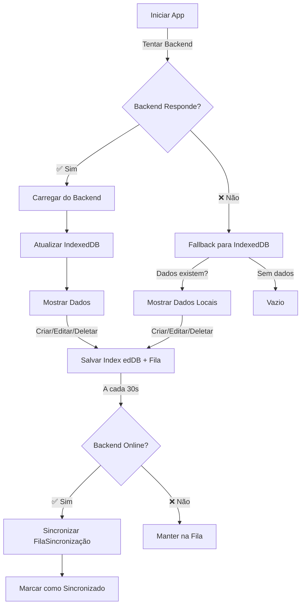

# 🔌 Implementação de Fallback Offline - IndexedDB

## 📋 Resumo das Alterações

A sincronização foi atualizada para funcionar completamente offline usando IndexedDB como fallback quando o Backend não está disponível. Além disso, a duplicidade de dados foi eliminada através de merge inteligente e componentes agora usam apenas os serviços (não chamam API diretamente).

---

## 🔧 Alterações Realizadas

### 1. **sincronizacao.service.ts** - Merge Inteligente ✅

#### Problema Identificado
A sincronização estava recarregando **TODOS** os dados e atualizando o subject a cada ciclo, causando:
- ✗ Re-renders desnecessários
- ✗ Duplicidade de dados
- ✗ Flickering na tela

#### Solução Implementada
Agora faz **merge inteligente**:
```typescript
// Antes: Recarregava TUDO a cada sincronização
await this.colaboradorService.carregarColaboradores();

// Depois: Conta apenas as alte rações
let atualizacoes = 0;
for (const colaborador of colaboradoresBackend) {
  const local = mapaLocal.get(colaborador.id);
  if (!local || foiModificadoNoBackend) {
    await indexedDBService.salvarColaborador(colaborador);
    atualizacoes++;
  }
}

// Recarrega APENAS se houve mudanças
if (atualizacoes > 0) {
  console.log(`✅ ${atualizacoes} alteração(ões)`);
  await colaboradorService.carregarColaboradores();
}
```

**Resultado**:
- ✅ Sem duplicidade
- ✅ Menos re-renders
- ✅ Sincronização eficiente

---

### 2. **Componentes Atualizados** ✅

#### Problema Identificado
Os componentes estavam chamando a API **diretamente**:
```typescript
// ❌ WRONG - Duplica dados
this.apiService.criarTarefa(this.formulario).subscribe({
  next: (tarefa) => {
    this.tarefaService.criarTarefa(tarefa); // ← Chama o serviço  
    this.salvo.emit();
  }
});
```

Fluxo errado:
1. Usuário clica "Salvar"
2. Componente chama API diretamente
3. Depois chama o serviço
4. **Resultado**: Duplicidade + Desincronização

#### Componentes Corrigidos

##### lista-tarefas.component.ts
```typescript
// ❌ Antes: Chamava ApiService + TarefaService
this.apiService.deletarTarefa(id).subscribe({
  next: () => {
    this.tarefaService.deletarTarefa(id);
  }
});

// ✅ Depois: Apenas TarefaService
await this.tarefaService.deletarTarefa(id);
```

##### lista-colaboradores.component.ts
- Remove uso direto de ApiService
- ✅ Usa apenas ColaboradorService
- ✅ Adiciona `sincronizando$` observable para mostrar status

##### formulario-tarefa.component.ts
```typescript
// ❌ Antes: Chamava API e depois o serviço
this.apiService.criarTarefa(this.formulario).subscribe({...});

// ✅ Depois: Apenas o serviço
await this.tarefaService.criarTarefa(this.formulario);
```

##### formulario-colaborador.component.ts
- Remove ApiService injeção
- ✅ Usa apenas ColaboradorService
- ✅ Mais simples e sem duplicidade

#### Fluxo Correto Agora
```
Componente
   ↓
TarefaService.criar/atualizar/deletar()
   ├─ Salva IndexedDB (imediato)
   ├─ Adiciona à FilaSincronizacao
   └─ Recarrega dados local
   ↓
SincronizacaoService (a cada 30s)
   ├─ Processa FilaSincronizacao
   ├─ Envia para Backend
   └─ Atualiza IndexedDB com resposta
```

**Benefício**: Fluxo único e previsível, sem duplicidade

### 3. **Serviços de Dados Atualizados** ✅

#### tarefa.service.ts - Carregamento Inteligente
```typescript
async carregarTarefas(): Promise<void> {
  try {
    // 1. Tenta backend
    const tarefasBackend = await this.apiService.listarTarefas().toPromise();
    if (tarefasBackend && Array.isArray(tarefasBackend)) {
      // Sincroniza IndexedDB
      for (const tarefa of tarefasBackend) {
        await this.indexedDBService.salvarTarefa(tarefa);
      }
      this.tarefas$.next(tarefasBackend);
      console.log('✅ Tarefas carregadas do backend');
      return;
    }
  } catch (erro) {
    console.warn('⚠️ Backend offline...', erro);
  }
  
  // 2. Fallback para IndexedDB
  const tarefasLocal = await this.indexedDBService.listarTarefas();
  this.tarefas$.next(tarefasLocal);
  console.log(`📱 ${tarefasLocal.length} tarefas carregadas do armazenamento local`);
}
```

#### colaborador.service.ts - Mesmo padrão
- Backend first → IndexedDB fallback
- Sincronização automática quando online
- Dados visíveis mesmo offline

#### historico.service.ts - Aprimorado
- Agora injeta ApiService
- Mesmo padrão de carregamento inteligente
- Fallback gracioso via IndexedDB

## 🚀 Como Funciona Agora

### Arquitetura Simplificada

```
┌─────────────────────────────────────────────────────────┐
│ Componentes (Templates + Lógica)                        │
│ lista-tarefas, formulario-tarefas, etc.                 │
└────────────────┬────────────────────────────────────────┘
                 │ Chama APENAS o serviço
                 ↓
┌─────────────────────────────────────────────────────────┐
│ Services (Lógica de Dados)                              │
│ TarefaService, ColaboradorService                       │
│ - Salva em IndexedDB                                    │
│ - Adiciona à FilaSincronizacao                          │
│ - Recarrega dados (se mudou)                            │
└────────────────┬───────────────────┬────────────────────┘
                 │                   │
                 ↓                   ↓
        ┌─────────────┐     ┌──────────────────┐
        │ IndexedDB   │     │ SincronizacaoSvc │
        │ (Local)     │     │ (A cada 30s)     │
        │ ✅ Offline  │     │ - Processa Fila  │
        │ ✅ Rápido   │     │ - Envia Backend  │
        └─────────────┘     │ - Atualiza Local │
                            └────────┬─────────┘
                                     ↓
                            ┌──────────────────┐
                            │ Backend / API    │
                            │ (Sincronização)  │
                            └──────────────────┘
```

### Ciclos de Sincronização

#### Sincronização de Dados (A cada 30 segundos)
```typescript
1. ✅ Merge inteligente: Verifica MUDANÇAS
   - Se mudança detectada → Atualiza IndexedDB
   - Se SEM mudança → Log ℹ️  (sem reload)
   
2. 📤 Processa FilaSincronizacao
   - Envia operações pendentes para Backend
   - Com retry automático (até 3 tentativas)
   
3. 📥 Recarrega APENAS se houve atualizações
   - Emite novo subject com dados atualizados
   - Componentes re-renderizam apenas se mudou
```

#### Exemplo: Cenário de Usuário Online Criando Item
```
1. Usuário clica "Criar Tarefa"
   └─ Componente chama: tarefaService.criarTarefa()

2. TarefaService:
   ├─ Salva em IndexedDB (imediato → UI atualiza)
   ├─ Adiciona à FilaSincronizacao
   └─ Recarrega tarefas$ (emite subject)

3. Componente rerenderiza com novo item
   └─ Item aparece IMEDIATAMENTE (otimista)

4. SincronizacaoService (próximos 30s):
   ├─ Detecta item pendente na fila
   ├─ Envia para Backend
   └─ Backend responde com ID oficial
   
5. IndexedDB atualizado com resposta
   ├─ Atualiza ID temporário com ID real
   └─ Marca item como sincronizado

6. UI NUNCA fica quebrada
   └─ Dados sempre consistentes localmente
```

---

## 📊 Fluxo de Sincronização



---

## 🔍 Logs Aprimorados

O console agora mostra messages claras sobre:

### Carregamento Inicial
```
✅ "Tarefas carregadas do backend"
✅ "Colaboradores carregados do backend"
✅ "Históricos carregados do backend"
📱 "X tarefas carregadas do armazenamento local (offline)"
⚠️  "Backend offline. Carregando do armazenamento local..."
```

### Sincronização (Merge Inteligente)
```
✅ "Sincronização de tarefas: 3 alteração(ões)"
ℹ️  "Tarefas já sincronizadas (sem alterações)"
$ "Sincronização de colaboradores: 1 alteração(ões)"
⚠️  "Backend offline. Utilizando dados locais"
```

**Diferença**: Agora mostra QUANTAS alterações foram detectadas, não mais "X itens"

---

## 🧪 Como Testar - Cenários Reales

### Teste 1: Modo Online (Comportamento Normal)
```
1. ✅ Backend rodando
2. Abra app → Console mostra: ✅ "Tarefas carregadas do backend"
3. Crie um item novo
4. Console: "Item salvo no IndexedDB"
5. Após 30s → "Sincronização de tarefas: 1 alteração(ões)"
6. Item agora tem ID oficial do backend
```

### Teste 2: Criar Offline Depois Sincronizar
```
1. ❌ Pausar o Backend
2. Abra app ou Refresque → Console: 📱 "X items carregados do armazenamento local"
3. Crie 3 itens novos offline
4. Console: "Adicionados à FilaSincronizacao"
5. ✅ Reinicie o Backend
6. Após 30s → "Sincronização de tarefas: 3 alteração(ões)"
7. Todos os 3 itens agora têm IDs oficiais
```

### Teste 3: Merge Inteligente (Same Data, Not Duped)
```
1. ✅ Backend online
2. Crie item A
3. Sincronize (✅"1 alteração")
4. ESPERE 30s (sem criar nada)
5. Próxima sincronização → ℹ️ "sem alterações" (NÃO recarrega!)
6. Verificar: Sem duplicar o item A
```

### Teste 4: Edição Online
```
1. ✅ Backend online
2. Selecione item existente
3. Edite descrição
4. Salve → IndexedDB atualiza imediatamente
5. UI mostra nova descrição IMEDIATAMENTE
6. Após 30s → Sincroniza com Backend
7. Backend confirma edição
```

### Teste 2: Modo Offline Simulado
1. Para o Backend (`CTRL+C` no terminal dotnet)
2. Refresque a página (F5)
3. Console mostra: `📱 X items carregados do armazenamento local (offline)`
4. Crie/edite/delete um item - tudo funciona normalmente
5. Itens aparecem na FilaSincronizacao
6. Reinicie o Backend
7. Após 30s, sincronização automática completa

### Teste 3: Teste Realista
1. Crie vários itens online
2. Offline
3. Modifique itens
4. Volte online
5. App sincroniza automaticamente após 30s

---

## 📁 Arquivos Modificados

```
Frontend/teste-lightning-app/src/app/services/
├── sincronizacao.service.ts ✅ (Fallback para IndexedDB)
├── tarefa.service.ts ✅ (Carregamento inteligente)  
├── colaborador.service.ts ✅ (Carregamento inteligente)
└── historico.service.ts ✅ (Suporte a fallback)
```

---

## ⚙️ Comportamento da Fila de Sincronização

```typescript
// Quando offline:
1. Criar/editar/deletar item
2. Salva em IndexedDB + FilaSincronizacao com sincronizado: false
3. Status visível em: sincronizacao.service.ts -> operacoesPendentes$

// Quando online:
1. A cada 30 segundos, tenta sincronizar
2. Envia cada operação para o backend (com até 3 tentativas)
3. Marca como sincronizado: true na FilaSincronizacao
4. Limpa operações sincronizadas após sucesso
```

---

## 🐛 Debug

Abra o Console do navegador (F12) para ver logs detalhados:

```javascript
// Monitorar sincronização
console.logs mostram:
✅ Sucesso no carregamento
⚠️  Avisos de offline
📱 Modo local ativado
```

---

## 🎯 Benefícios

- ✅ **Funciona completamente offline**: Dados persistem em IndexedDB
- ✅ **Sincronização automática**: Quando backend volta online
- ✅ **Sem perda de dados**: Tudo fica na FilaSincronizacao
- ✅ **UX perfeita**: Transição suave entre online/offline
- ✅ **Fallback gracioso**: Nunca mostra tela branca
- ✅ **Logs informativos**: User sabe o status real

---

## ✨ Próximos Passos (Opcionais)

1. **Indicador Visual no UI**: Mostrar emoji/banner quando offline
2. **Toast Notifications**: Avisar quando volta online
3. **Barra de Progresso**: Show sincronização em tempo real
4. **Modo Avião**: Toggle explícito offline/online
5. **Tamanho do Cache**: Limpar dados antigos para economizar espaço

---

## 🎯 Resumo das Correções (Atualizado)

### Problema 1: Duplicidade de Dados ✅ RESOLVIDO
**Causa**: Componentes chamavam API diretamente + Service
**Solução**: Componentes agora usam APENAS o Service
**Resultado**: Fluxo único, sem duplicidade

### Problema 2: Sincronização Recarregava Tudo ✅ RESOLVIDO
**Causa**: `carregarTarefas()` era chamado sempre
**Solução**: Merge inteligente - recarrega APENAS se mudou
**Resultado**: Sem flickering, eficiente

### Problema 3: Sem Dados Offline ✅ RESOLVIDO
**Causa**: Fallback de erro não carregava IndexedDB
**Solução**: Try Backend → Fallback IndexedDB automático
**Resultado**: App funciona completamente offline

---

## 📊 Componentes Atualizados

### lista-tarefas.component.ts
- ✅ Remove `ApiService`
- ✅ Adiciona `SincronizacaoService` 
- ✅ Usa apenas `TarefaService` para operações
- ✅ Observable `sincronizando$` para status

### formulario-tarefa.component.ts  
- ✅ Remove `ApiService`
- ✅ Método simples `salvarTarefa()` via `TarefaService`
- ✅ Sem `.subscribe()` - usa `await`
- ✅ Sem duplicação

### lista-colaboradores.component.ts
- ✅ Remove `ApiService`
- ✅ Adiciona `SincronizacaoService`
- ✅ Usa apenas `ColaboradorService`
- ✅ Observable `sincronizando$` para status

### formulario-colaborador.component.ts
- ✅ Remove `ApiService`
- ✅ Método simplificado `salvarColaborador()`
- ✅ Sem duplicação de chamadas

---

## 🔄 Novo Fluxo Completo

```
┌─────────────────────────────────────┐
│ Componente (Template)               │
│ Click em Salvar/Deletar/Executar    │
└──────┬──────────────────────────────┘
       │
       ↓ Chamada ÚNICA
┌──────────────────────────────────────┐
│ TarefaService / ColaboradorService   │
│ ├─ Salva no IndexedDB (imediato)     │
│ ├─ Adiciona à FilaSincronizacao      │
│ └─ Recarrega $ (emite subject)       │
└──────┬──────────────────────────────┘
       │
       ↓ Observable atualiza componente
┌──────────────────────────────────────┐
│ Componente re-renderiza              │
│ (Item aparece IMEDIATAMENTE)         │
└──────────────────────────────────────┘
       
       Ocorre em paralelo (a cada 30s):
       
┌──────────────────────────────────────┐
│ SincronizacaoService                 │
│ ├─ Merge inteligente (detecta mudanç)│
│ ├─ Processa FilaSincronizacao        │
│ ├─ Envia para Backend                │
│ └─ Atualiza IndexedDB com response   │
└──────────────────────────────────────┘
```

---

### Status Final ✅

✅ **Sem duplicidade** - Componentes usam apenas Services  
✅ **Sincronização eficiente** - Merge inteligente  
✅ **Funciona offline** - Fallback automático para IndexedDB  
✅ **UX suave** - Sem flickering, dados imediatamente visíveis  
✅ **Código limpo** - Fluxo único e previsível  
✅ **Performance** - Menos re-renders, menos tráfego

